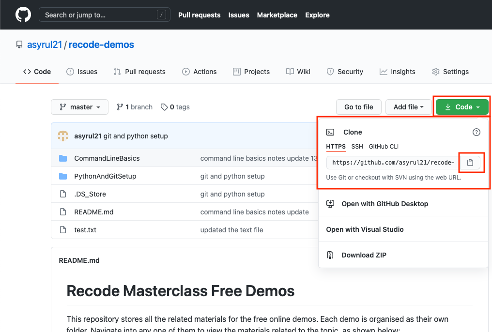

# Recode Beginner Python Masterclass

Welcome to Recode's Beginner Python Masterclass!

This is the official repository of the course, which contains all the materials you need throughout the course.

UPDATE: This repostiory has been moved to the shared One Drive folder.

To clone this repository to your local machine, follow these steps:

1. Copy the link of this repo by clicking the Code button on the right and click the copy the link or click the clipboard button:

   

2. Make sure you have Git installed and set up.

3. Create a folder in your local machine anywhere you would like the course material to be. I suggest in Documents, create a folder called Programming, where you can store all your programming stuff. Then, within the Programming folder, create another folder called Python where you will store all python-related files/folders.

   _SOME TIPS WHEN CREATING A FILE OR A FOLDER_

   1. avoid names with spaces. use dashes "-" or camel case to connect various words. Example:

   - dash : my-folder-name
   - camel case : myFolderName

   2. Avoid using Symbols or [unicode characters](https://www.compart.com/en/unicode/category/So) in your file/folders names.

   3. Plain english would do it.

4. On your terminal, navigate to the created folder. Use `ls -l` and `cd` to traverse through your file system. On Windows, use `dir` and `cd`.

5. Once you have reached your desired folder, clone this repo by running:

   ```bash
   git clone https://github.com/asyrul21/recode-beginner-python.git
   ```

6. Every week, new content will be removed/added according to tutor's or students' needs. To ammend those changes locally into your machines, before each class, run:

   ```bash
   git pull
   ```

7. Happy Coding!

## Pre Requisites

Below going through the classes, you may find our demo classes helpful. You can find our demo class videos on our instagram's IGTV, and the git repository [here](https://github.com/asyrul21/recode-demos.git)
