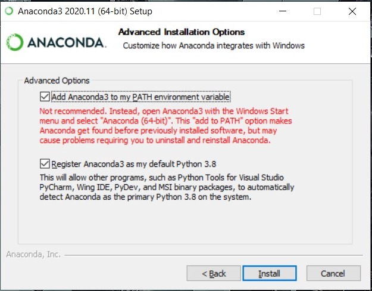
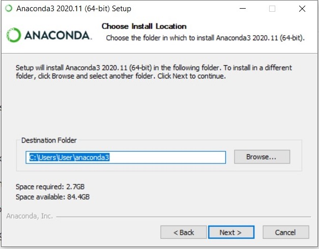
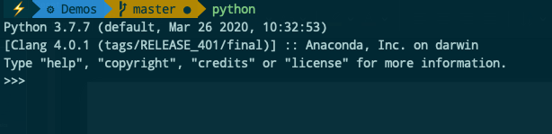

# Week 1

## Installing Python

### Windows 10

1. Download and Install Anaconda

   - Go [Here](https://docs.anaconda.com/anaconda/install/windows/) and follow the steps

   _IMPORTANT NOTE_

   - Select the right version

   - Be sure to SELECT "Add Anaconda to the PATH environment variable"

     

   - don't need to install PyCharm

   - Install Anaconda to a directory path that does not contain spaces or unicode characters.

     

   - Verify: Open Anaconda Navigator

   - Close Anaconda navigator

2. Open Comman prompt and type:

   ```bash
   python
   ```

   Should look like this:

   

3. To install additional dependencies, simple do

   ```
   conda install [name of package]
   ```

4. For user guide and list of pre installed packages, visit [here](https://docs.anaconda.com/_downloads/9ee215ff15fde24bf01791d719084950/Anaconda-Starter-Guide.pdf).

<br/>

## For Mac

1. Python is usually pre-installed on mac. To check (note tha capitalised V):

   ```bash
   python -V
   ```

   if you get something like this:

   ```
   Python 3.7.7
   ```

   then congratulations! You already have python installed

2. Otherwise,

3. Verify you have Pip, which is a dependency manager.

   ```bash
   pip -V
   ```

   You should get something like this:

   ```bash
   pip 20.1.1 from /opt/anaconda3/lib/python3.7/site-packages/pip (python 3.7)
   ```

<br/>

## Installing an IDE

1. Go to [Notepad++](https://notepad-plus-plus.org/downloads/)

2. Customise your theme

<br/>

# Command Line Basics

The command line used to be the primary interface between a user and a computer. Nothing a person can do on a GUI, which cannot be done on the command line.

_IMPORTANT NOTE_

If you are using MacOS or Linux, these commands are the same. However, if you use Windows, the commands are different. In this demo we'll go through only the linux commands, but you can try out the windows commands yourself.

Also, in Windows, directory slashes "/" are backwards "\\". Example

macOS/Linux: Documents/Development/RecodeMasterclass/Demos

Windows: Documents\\Development\\RecodeMasterclass\\Demos

## Commands (macOS,Linux/Windows)

Break those commands intro 3 categories:

1. Navigational
2. File Manipulation
3. File READ/WRITE
4. Others

### Navigation Commands - _MOST IMPORTANT_

1. pwd / cd

- Show current directory

2. ls / dir

- show list of files in current directory

3. cd \_ / cd \_

- traverse into or out of a folder

### File Manipulation Commands

4. mkdir / mkdir

- create a folder

5. touch / call >>

- create a file

6. rm / del, rm -rf / deltree

- delete file, folder
- -r means recursively

7. mv / move

- move or rename a file

8. cp / copy, cp -R / xcopy

- copy files, folder over

### File READ/WRITE Commands

9. cat / type

- view the file

10. nano / - (could be configured using WSL (Windows Sub System))

- edit the file

### Other

11. man / help

- show manual or help

12. clear / cls

- clear the command line screen

13. Running and application - same for both - _IMPORTANT_

    Must:

    - must be in same directory
    - language libraries must be installed

    Examples:

    - python [filename]
    - node [filename]
    - ./[filename].sh
    - java [java program name]

<br></br>

# References

[Windows and Unix command line equivalents](https://www.lemoda.net/windows/windows2unix/windows2unix.html)
