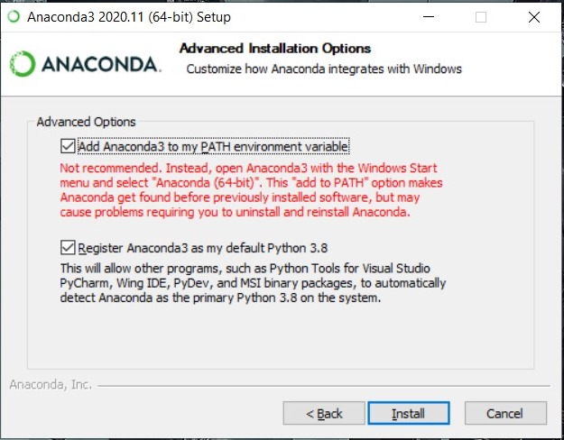
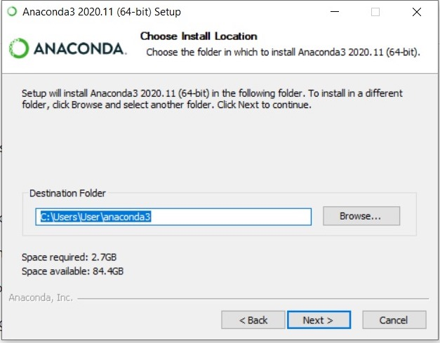
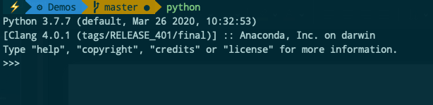

# Week 1

## Installing Python

### Windows 10

1. Download and Install Anaconda

   - Go [Here](https://docs.anaconda.com/anaconda/install/windows/) and follow the steps

   _IMPORTANT NOTE_

   - Select the right version

   - Be sure to SELECT "Add Anaconda to the PATH environment variable"

     

   - don't need to install PyCharm

   - Install Anaconda to a directory path that does not contain spaces or unicode characters.

     

   - Verify: Open Anaconda Navigator

   - Close Anaconda navigator

2. Open Command prompt and type:

   ```bash
   python
   ```

   Should look like this:

   

3. To install additional dependencies, simply do

   ```
   conda install [name of package]
   ```

4. For user guide and list of pre installed packages, visit [here](https://docs.anaconda.com/_downloads/9ee215ff15fde24bf01791d719084950/Anaconda-Starter-Guide.pdf).

<br/>

### For Mac

1. Go [here](https://docs.anaconda.com/anaconda/install/mac-os/) and follow the steps.

<br/>

## Verify Installation

Type:

```bash
python -V
```

You should get something like:

```bash
Python 3.7.7
```

Type:

```bash
pip -V
```

You should get something like:

```bash
pip 20.1.1 from /opt/anaconda3/lib/python3.7/site-packages/pip (python 3.7)
```

<br/>

## Installing a Code Editor

You can use [Visual Studio Code](https://code.visualstudio.com), although it is quite advanced. If you want simpler code editor:

### For Windows Users

1. Go to [Notepad++](https://notepad-plus-plus.org/downloads/)

2. Download and install

3. Customise your theme

### For Mac Users

1. Go to [TextMate](https://macromates.com)

2. Download and install

<br/>

# Command Line Basics

The command line used to be the primary interface between a user and a computer. Nothing a person can do on a GUI, which cannot be done on the command line.

_IMPORTANT NOTE_

If you are using MacOS or Linux, these commands are the same. However, if you use Windows, the commands are different. In this demo we'll go through only the linux commands, but you can try out the windows commands yourself.

Also, in Windows, directory slashes "/" are backwards "\\". Example

macOS/Linux: Documents/Development/RecodeMasterclass/Demos

Windows: Documents\\Development\\RecodeMasterclass\\Demos

## Commands (macOS,Linux/Windows)

Break those commands intro 3 categories:

1. Navigational
2. File Manipulation
3. File READ/WRITE
4. Others

### Navigation Commands - _MOST IMPORTANT_

1. Show current directory

   Unix: pwd

   Windows: cd

2. Show list of files in current directory

   Unix: ls

   Windows: dir

3. Traverse into or out of a folder

   cd \_

   cd ..

### File Manipulation Commands

4. Create a folder

   mkdir [name of folder]

5. Create a file

   Unix: touch [file]

   Windows: call >> [file]

6. Delete file, folder

   Unix: rm [file]

   Windows: del [file]

   Unix: rm -rf [folder]

   Windows: rd /s /q [path]

7. Move or rename a file

   Unix: mv [file]

   Windows: move [file]

8. Copy files, folder over

   Unix: cp [file]

   Windows: copy [file]

   Unix: cp -R [folder]

   Windows: xcopy [folder]

### File READ/WRITE Commands

9. View the file

   Unix: cat [file]

   Windows: type [file]

10. Edit the file

    Unix: nano [file]

    Windows: - (could be configured using WSL (Windows Sub System))

### Other

11. Show manual or help

    Unix: man [command]

    Windows: help

12. Clear the command line screen

    Unix: clear

    Windows: cls

13. Running and application - same for both - _IMPORTANT_

    Must:

    - must be in same directory
    - language libraries must be installed

    Examples:

    - python [filename]
    - node [filename]
    - ./[filename].sh
    - java [java program name]

<br></br>

# References

[Windows and Unix command line equivalents](https://www.lemoda.net/windows/windows2unix/windows2unix.html)
