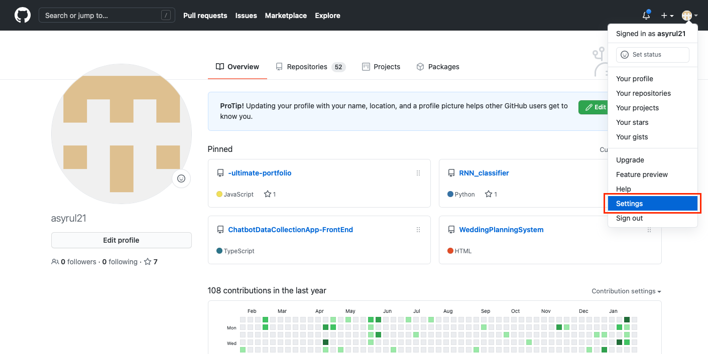
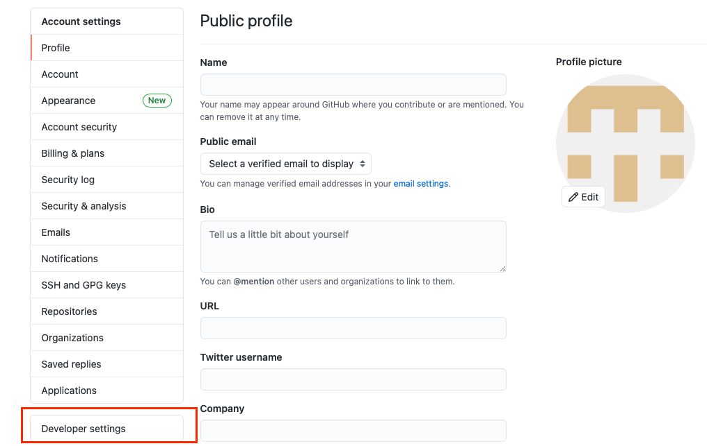
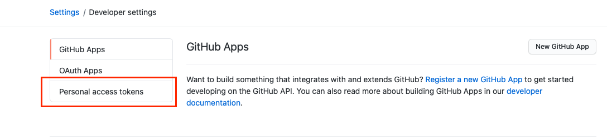
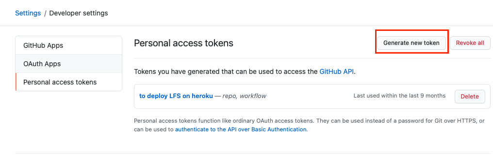
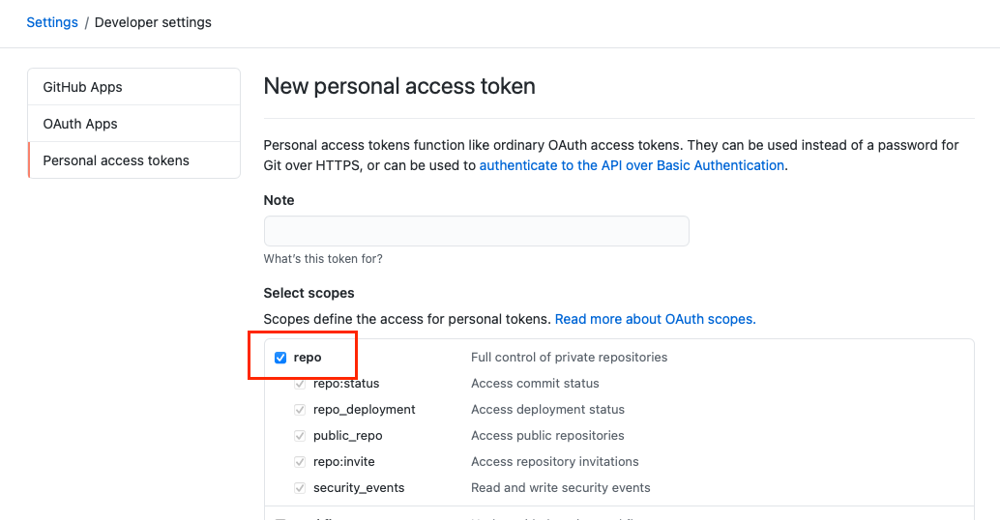
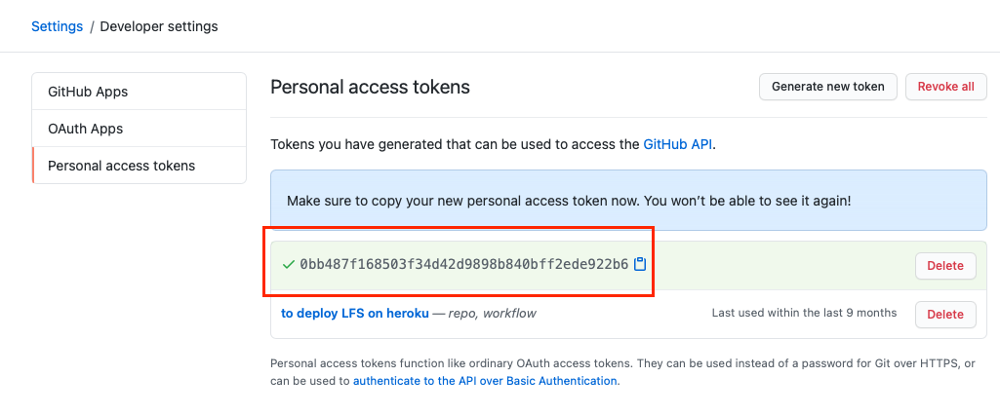

# Source Control with Git Basics

For this lesson we will go over the fundamental concepts of GIT source control.

This document is divided into THREE main parts:

1. Conceptual Overview and Setup
2. Creating your first repository
   - will be useful later when you start your own project
3. Working with exiting repository

These words may not make much sense to you. In fact there are whole books [[1](https://www.goodreads.com/book/show/6518085-pro-git) ,[2](https://www.goodreads.com/book/show/51649022-beginning-git-and-github)] written just to educate programmers on Git. However, I will do my best to explain within the two parts.

<br/>

## Conceptual Overview and Setup

### Conceptual Overview

Go to `slides/gitbasics.pptx`.

<br/>

### Git Setup

Before you can create your first repository on Github, you must first setup Git on your machine. Follow these steps:

1. Download and Install Git from [here](https://git-scm.com/downloads).

   - Just click next for all.

2. On [Github](https://github.com), Sign Up and create a new account.

3. Connect your local Git to your Github

   ```
   git config --global user.name "[Your name here]"
   git config --global user.email "[your github email]"
   ```

   example:

   ```
   git config --global user.name "asyrul"
   git config --global user.email "asyrul@mail.com"
   ```

   <br/>

## Creating Your First Repository

_IMPORTANT NOTE_

_You would only go through this part before starting on your course project - sometime in Week 8_

Once you have set up your Git, you can then create a new repository by following these steps:

1. Create a new repository on your Github account.

2. Initialise git in the local repository.

   ```bash
   git init
   ```

3. Stage file changes

   ```bash
   git add .
   ```

4. Commit your changes

   ```bash
   git commit -m "this is my first commit"
   ```

5. Configure git remote location

   ```bash
   git remote add [link to your repository]
   ```

6. Git push to your repository in github

   ```bash
   git push origin master
   ```

7. If it is your first time doing this, you will get a pop up that allows you to verify your github credentials, which looks like this:

   

   This is to connect your local Git to your Github account you created just now. You will only do this once - the first time. Click the _Sign in with your Browser_

8. Simply type in your email and password, and your local changes will reflect on your Github repository. If Git insits to use Personal Access Token, follow the steps in the next section.

<br/>

### How to Generate Your Personal Access Token

For security purposes, Git may insist that you sign in to your Github using a Personal Access Token instead of the usual username and password. If that is the case, follow the steps below.

1. Go to your Github home page. At the top right, click the your icon and go to Settings.

   

2. On the left pane, find _Developer Settings_.

   

3. On the left pane, select Personal Access Token.

   

4. Click Generate New Token

   

5. Select the top most checkbox, and give it a note (e.g. Manage Repository):

   

   Then, at the bottom, click _Create_

6. Copy the Personal Access Token.

   

7. Paste this token in the prompt.

   

<br/>

## Working on Existing Repositories

### Your Own Repositories

Once you have created and initialised your git repository, you can then go ahead and make changes to any file.

Once you have made those changes, you now should update your remote repository. To do so;

1.  You may check to see which files have been added, removed, or modified. Simple run:

    ```bash
    git status
    ```

    You may get something like this:

    ```bash
    On branch master

    Changes not staged for commit:
    (use "git add <file>..." to update what will be committed)
    (use "git restore <file>..." to discard changes in working directory)
    modified: README.md

    no changes added to commit (use "git add" and/or "git commit -a")
    ```

2.  Add the files you want to track, and commit, giving a meaningful message.

    ```bash
    git add . or git add README.md

    git commit -m "README file update"
    ```

3.  Push the changes to your remote master repository.

    ```bash
    git push origin master
    ```

4.  (OPTIONAL) If you run `git push` without specifying the source and destination, you will get an error like this:

    ```bash
    fatal: The current branch master has no upstream branch.
    To push the current branch and set the remote as upstream, use

        git push --set-upstream origin master
    ```

    If you are planning to only work on the master branch (NOT RECOMMENDED), and would like to configure git to remember that you are always going to push from origin to master, you can set the remote as upstream:

    ```bash
    git push --set-upstream origin master
    ```

    Otherwise, dont set this configuration. Instead, always specify which branch you want to push to:

    ```bash
    git push origin [name of branch to push to]
    ```

<br/>

### Other People's Repositories

If you would like to clone other people's repository, you do not need to create a new one and manually copy and paste their repo. All you have to do is copy the link to the repository:

1. On the Author's repository page, on the right side clide the "Code" button and copy the link of the repository.

   

2. In your desired folder, run the clone command:

   ```bash
   git clone [paste the link]
   ```

   example:

   ```bash
    git clone https://github.com/asyrul21/recode-demos.git
   ```

3. This way, whenver the Author of the repo makes changes or updated the files, you can simply run:

   ```bash
   git pull
   ```

This will pull the changes made by the author to your local machine. NEAT! (This assumes that there's no CONFLICT). If there are, you can simply resolve those conflict in your text editor!
